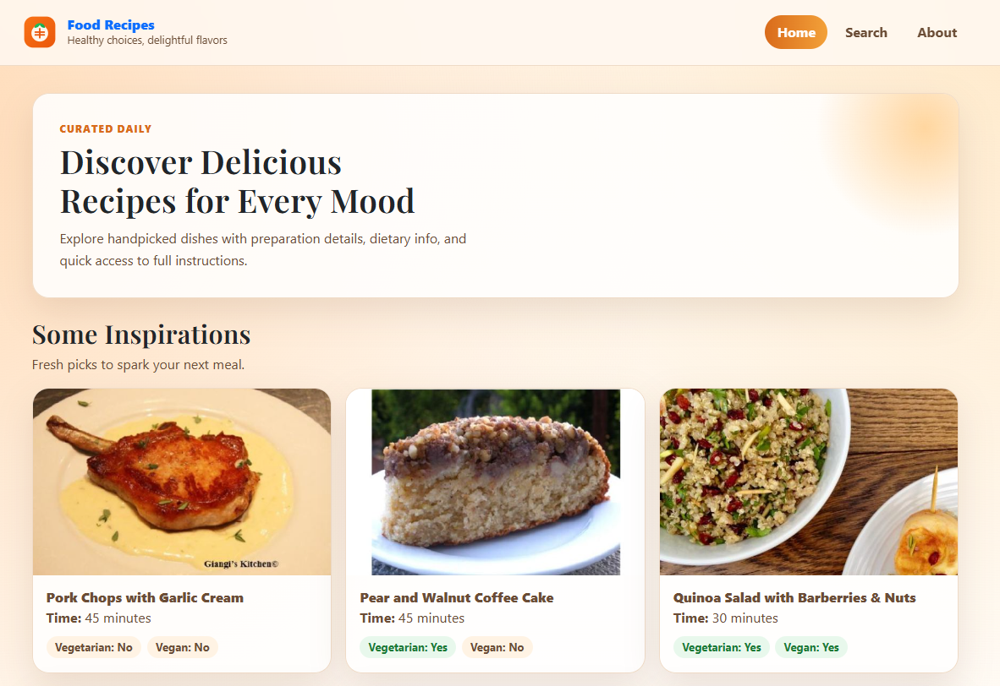

# Food Recipes App 🍽️

>A modern Angular app to discover recipes quickly, search by term, and open detailed views with key meal information.



## What This App Does ✨

- Shows random recipe suggestions on the Home page.
- Lets users load more ideas in batches.
- Supports search by recipe name or ingredient keyword.
- Opens a complete recipe details page.
- Displays similar recipes to keep discovery going.

## Main Pages 🧭

- Home (/): random recipes with Load more behavior.
- Search (/search): query-based recipe search.
- About (/about): app overview and creator links.
- Recipe details (/recipe?id=123): full recipe information by id.

## Tech Stack 🧱

- Angular 21 (standalone components)
- TypeScript
- RxJS
- Bootstrap 5
- Spoonacular API

## How The App Works Internally ⚙️

1. User navigates through Angular Router links in the header.
2. UI components call dedicated services for each data type.
3. Services use HttpClient to call Spoonacular endpoints.
4. Responses are rendered in cards and detail sections.
5. Loading and error states are shown to improve UX.

### Services

- RandomRecipes service:
	- Endpoint: /recipes/random
	- Used on Home page (initial list + load more)
- SearchService:
	- Endpoint: /recipes/complexSearch
	- Used on Search page
- SingleRecipe service:
	- Endpoints: /recipes/{id}/information and /recipes/{id}/similar
	- Used on Recipe details page

## Project Structure (High Level) 📁

- src/app/components
	- header, footer
	- pages/home
	- pages/search
	- pages/about
	- pages/single-recipe
- src/app/services
	- random-recipes
	- search
	- single-recipe
- src/environments
	- environments.example.ts (this file will become 'environment.ts' to work properly)

## API Key Setup 🔐

This project uses Spoonacular API. Add your key here:

- File: src/environments/environments-example.ts
- Property: apiKey

Example:

```ts
export const environment = {
	apiKey: 'YOUR_API_KEY_HERE',
};
```

Then, rename the file to 'environment.ts'.

## Run Locally 🚀

Install dependencies:

```bash
npm install
```

⚠️ Set up your API Key as instruced previouly.

Start development server:

```bash
ng serve
```

Open:

- http://localhost:4200/

## Build And Test 🧪

Build:

```bash
npm run build
```

Unit tests:

```bash
npm test
```

## UX Notes 🎨

- Responsive layout for desktop and mobile.
- Clear loading and error feedback.
- Accessible external links using target _blank + rel noopener noreferrer.

## Built With ⚡

- Recipe data: [Spoonacular API](https://spoonacular.com/food-api)
- Built with Angular

## License 📄

This project is open source under the terms of the [MIT License](LICENSE).

## 💬 Connect with Me
Follow my journey and other projects on:
- **LinkedIn:** [lucsantosdev](https://www.linkedin.com/in/lucsantosdev)
- **GitHub:** [lucsantosdev](https://github.com/lucsantosdev)
- **Email:** [lucsantosdev@gmail.com](mailto:lucsantosdev@gmail.com)
- **Support Me:** [Ko-Fi](https://ko-fi.com/lucsantosdev)

---

🧠 Je 9:23-24


